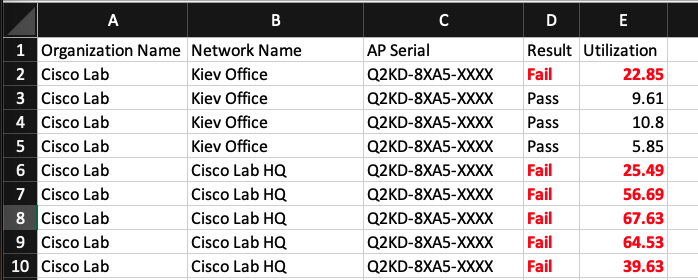
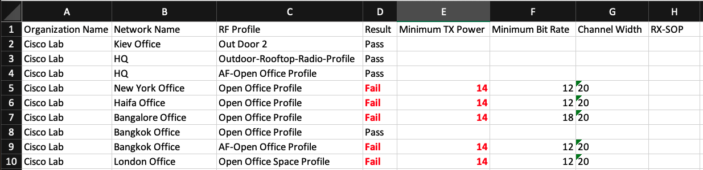
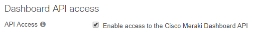
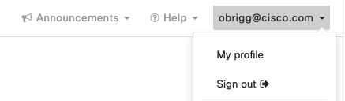
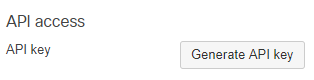

# Meraki Health Check 

### The Challenge

Cisco Meraki is an amazing cloud-managed IT solution, simplying network, security, security cameras and IoT infrastructure.
However, even the most intelligent AI/ML driven solution is still volunerable to users misconfiguring various options (usually without reading the documentation). Misconfiguration can result in an outage, or poor user experience (if you will limit user's traffic to 1Mbps - things will work slowly.. AI won't help there as it's the admin's "intent").

### The Solution

This script will leverage the Meraki API to compare an organization's settings and status against a set of best practices and thresholds - uncovering configurations that should be changed.

#### Example output
Summary tab:

Channel utilization tab:

RF Profile tab:

---
### List of checks
#### Wireless checks
1. Channel utilization (for 5GHz only, 2.4GHz is beyond saving...)
2. RF Profile check:
    * Configured Minimum Tx power (usually mistaken with EIRP, resulting to too high Tx power).
    * Configured minimum Bitrate.
    * Configured channel Width
    * Manually configured RX-SOP (most won't configure it right, and it's better left at "auto").

#### Switching checks
1. Are jumbo-frames enabled (checking the MTU)?
2. Is RSTP enabled? (best of luck handling loops without it..)
3. Port counters:
    * CRC errors.
    * Collisions.
    * Broadcasts exceeding threshold.
    * Multicasts exceeding threshold.
    * Topology changes (TCNs) exceeding threshold.
---
Convinced the health-check is worth 5 minutes of your time? let's do this!
### How to run the script:

#### Generate your Meraki API Key

1. Access the [Meraki dashboard](dashboard.meraki.com).
2. For access to the API, first enable the API for your organization under Organization > Settings > Dashboard API access.

3. After enabling the API, go to "my profile" on the upper right side of the dashboard to generate an API key. This API key will be associated with the Dashboard Administrator account which generates it, and will inherit the same permissions as that account.  You can generate, revoke, and regenerate your API key on your profile.

**Always keep your API key safe as it provides authentication to all of your organizations with the API enabled. If your API key is shared, you can regenerate your API key at any time. This will revoke the existing API key.**

#### Storing the Meraki API Key as an environment variable
Once the API key is obtained, you'll need to store the Meraki dashboard API key as an environment variable:
`export MERAKI_DASHBOARD_API_KEY = <YOUR MERAKI API KEY>`
and install the Meraki SDK via `pip install -r requirements.txt`

Now you're ready. Good luck!

`python run.py`

----
### Licensing info
Copyright (c) 2021 Cisco and/or its affiliates.

This software is licensed to you under the terms of the Cisco Sample
Code License, Version 1.1 (the "License"). You may obtain a copy of the
License at

               https://developer.cisco.com/docs/licenses

All use of the material herein must be in accordance with the terms of
the License. All rights not expressly granted by the License are
reserved. Unless required by applicable law or agreed to separately in
writing, software distributed under the License is distributed on an "AS
IS" BASIS, WITHOUT WARRANTIES OR CONDITIONS OF ANY KIND, either express
or implied.
